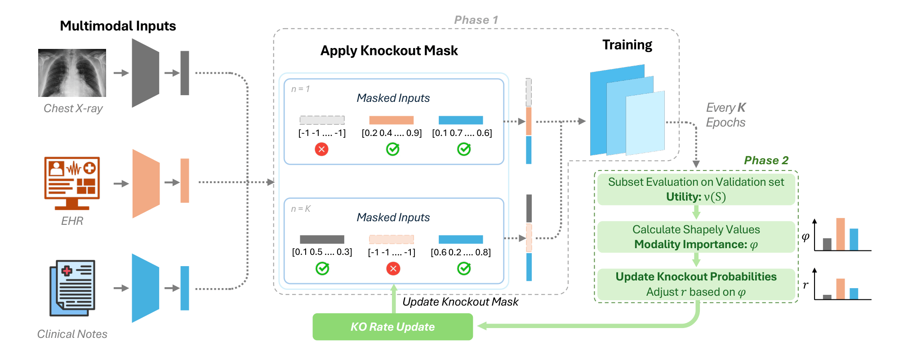

# ShapKO: Shapley-Adaptive Modality Knockout for Robust Multimodal Learning

This repository contains the official implementation of our MICCAI 2026 paper:
**"ShapKO: Shapley-Adaptive Modality Knockout for Robust Multimodal Learning"**

**Accepted at MICCAI 2026**

  

---

## 📄 Paper

> Nusrat Binta Nizam, Fengbei Liu, Sunwoo Kwak, Minh Nguyen, Ruining Deng, Mert R. Sabuncu.
> *ShapKO: Shapley-Adaptive Modality Knockout for Robust Multimodal Learning.*
> Accepted at MICCAI 2026.
> [Full Paper](#)  <!https://arxiv.org/abs/2607.09884>

Multimodal medical models often degrade when inputs are missing, a common
scenario in real clinical workflows. Even when all modalities are present,
*modality dominance* leads optimization to over-rely on the most predictive
modality and undertrain complementary sources. **ShapKO** periodically estimates
each modality's importance via **Shapley values** over validation subsets and
raises the knockout probability of dominant modalities (a *drop-strong-more*
rule), promoting complementary representations with **no architectural changes**.

---

## ⚙️ Method

ShapKO alternates between two phases:

- **Phase 1 — train under knockout.** Each present modality `m` is kept with
  probability `1 - r_m` (knocked out otherwise, at least one retained).
  Knocked-out and structurally-missing embeddings are replaced by fixed
  placeholders before fusion, and the model is trained on the task loss.
- **Phase 2 — adapt rates (every `K` epochs).** With the model frozen, ShapKO
  evaluates a scalar utility `v(S)` per modality subset on validation, estimates
  Shapley importances, and updates the per-modality knockout rates.
  
---
---

## 📂 Datasets

ShapKO is evaluated on three public multimodal benchmarks. The datasets are
**not** redistributed here — obtain them from the original sources below. Note
that MIMIC data requires credentialed PhysioNet access (CITI training).

**Prostate MRI — clinically significant prostate cancer detection (PI-CAI)**
- Benchmark paper: Saha et al., *Artificial intelligence and radiologists in prostate cancer detection on MRI (PI-CAI)*, The Lancet Oncology, 2024 — https://pi-cai.grand-challenge.org/
- Preprocessing [Link](https://github.com/DIAGNijmegen/picai_prep#mha-archive--nnu-net-raw-data-archive)

**Survival prediction — Multi-modal learning with Missing Data (MMD)**
- Benchmark paper: Cui et al., *Survival Prediction of Brain Cancer with Incomplete Radiology, Pathology, Genomic, and Demographic Data*, MICCAI 2022 — [arXiv:2203.04419](https://arxiv.org/abs/2203.04419) · [Springer](https://doi.org/10.1007/978-3-031-16443-9_60)
- Source data: derived from TCGA (TCGA-GBM / TCGA-LGG) via the GDC Data Portal: https://portal.gdc.cancer.gov/

**Multitask clinical classification (FlexCare / MIMIC-IV)**
- Benchmark paper: Xu et al., *FlexCare: Leveraging Cross-Task Synergy for Flexible Multimodal Healthcare Prediction*, KDD 2024 — [arXiv:2406.11928](https://arxiv.org/abs/2406.11928)
- Code: https://github.com/mhxu1998/FlexCare
- Underlying data (PhysioNet, credentialed access):
  - MIMIC-IV (EHR): https://physionet.org/content/mimiciv/
  - MIMIC-CXR (chest X-ray): https://physionet.org/content/mimic-cxr/
  - MIMIC-IV-Note (clinical notes): https://physionet.org/content/mimic-iv-note/

## 📬 Contact

For questions or issues, reach out to: 📧 nn284@cornell.edu
